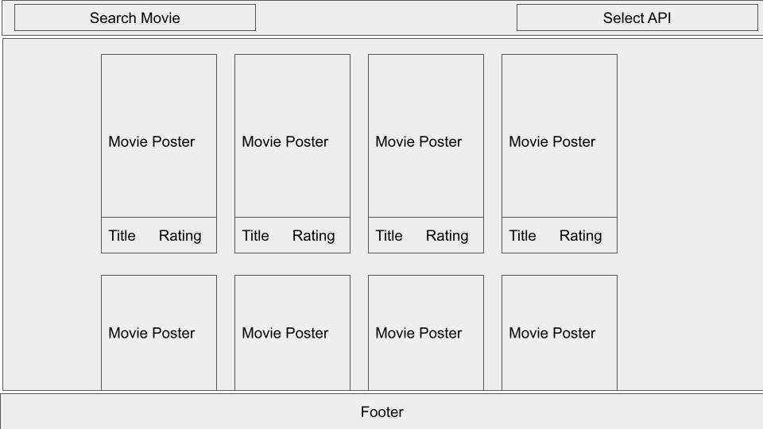
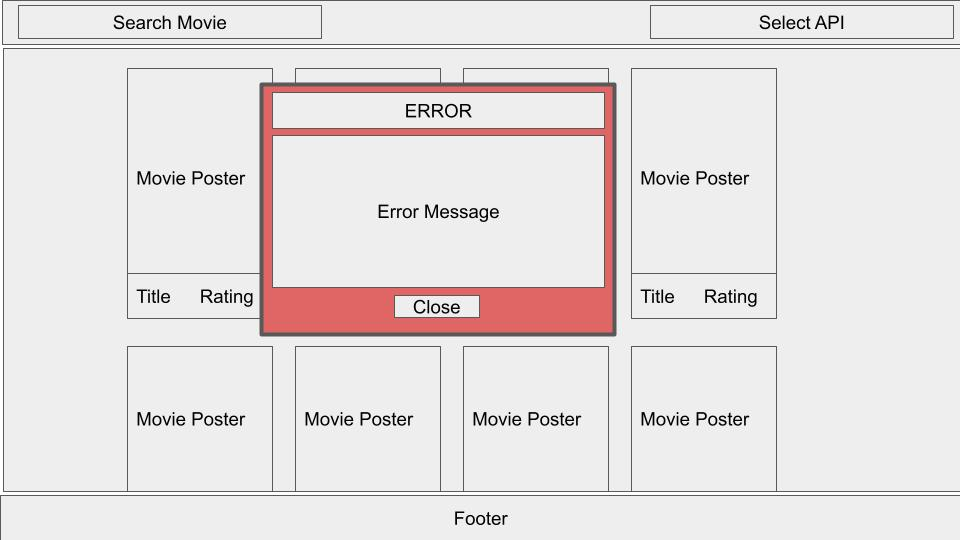

# Project Roadmap (APIs)

## Description

A Web App connecting to two separate movie databases (APIs) and displaying the query results in movie cards.

It starts with a default query for popular movies in the first end point.

It will have `Movie Search` capability from the databases.

Movie databases can be selected with a radio group.

Users can get additional information by clicking the movie cards on the screen.

Errors will be shown in a modal form.

Header, body and footer sections will be designed responsively.

### Nice To Have

Add a weather interface using a free weather API.

Try to integrate additional APIs if convenient.

## Plan

- Select the appropriate online movie databases.
*TMDB and OpenMovieDB selected.*

- Subscribe the online db services.
*Done*

- Create the frontend.
*Started.*

- Connect to the APIs and update the frontend.
*Continuing*

- If finish early, integrate the additional capabilities.

## Design

- Design will be **responsive**.
- **Flexbox** will be the main alignment tool.
- A modal form will be designed for both `movie details info` and `error messages`.

